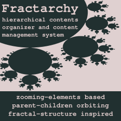

# fractarchy-ide

(v 0.1 - alpha)

- - -

**tags:** content-management-system, hierarchical-data-organizer, text-processing-toolkit, fractal-structure-inspired, parent-children-orbiting, zooming-elements-based

- - -

> ## promotional material
> 
> 
>
> Coders? I'm not sure how they do it, but they combine a heart of a playful child with a wisdom of an experienced elderly. Sure, there is a certain value in all those WYSIWYG tools around, but the most of them miss out that mystical aura around having a full control under our fingertips. Something magical happens in the moment when a code begins to exhibit intended behavior, and capturing that valuable moment is something I want to pass to users of this project.
> 
> There are many types of coding super-powers, but in this project, I wrapped coding of visual contents into a fun interface, and I tried to make the coding itself a fun. A brand new language customized for a sake of coding visual contents is bundled together with a brand new visual interface extruded from a system of input/output duality. Keep your souls safe beneath the comfort zone, but keep your hearts open, and join me on a journey of coding visual contents using an interface inspired from another world. You may heard of that world before. It is called imagination. And, as you may already know, that world may be pretty awesome.

    // under construction //
        

[online probe](https://contrast-zone.github.io/fractarchy-ide/index.html)

    // under construction //

