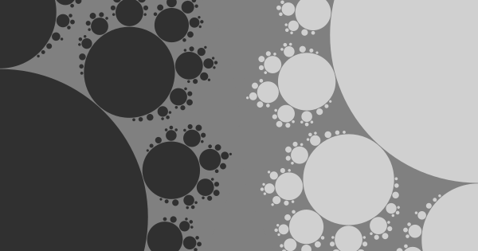
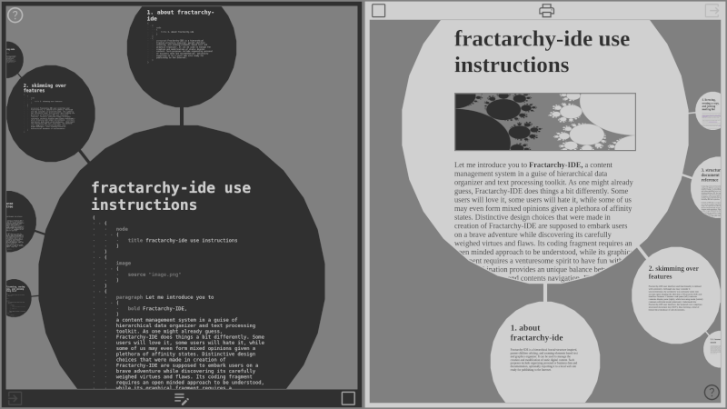
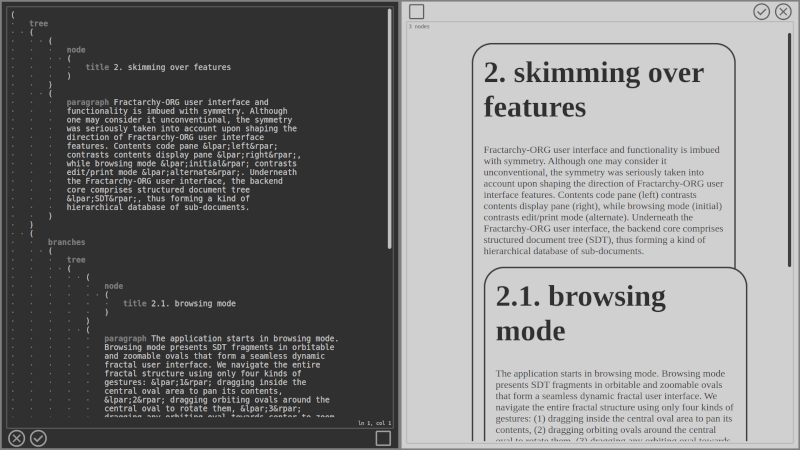

# Fractarchy-ORG

(v 0.1 - beta)

**tags:** workbook-cms, structured-document-tree, hierarchical-content-organizer, data-visualization-project, text-processing-toolkit, zooming-elements-based, parent-children-orbiting, fractal-structure-inspired

> ## promotional material
> 
> 
> 
> Fractarchy-ORG is a hierarchical content organizer that tries to amplify the simplicity of coding in a fun and exciting direction of composing interactive visual contents. This project bundles a brand new content markup language with a brand new visual interface. Give Fractarchy-ORG a chance, and take a journey of coding visual contents in this unusual creation inspired from the world of imagination.

## why fractarchy-org?

Coders combine the heart of a playful child with the wisdom of an experienced elderly. Sure, there is a certain value in all the WYSIWYG tools around, but the most of them miss that mystical aura of having a full control at our fingertips. Something magical happens at the moment when a code begins to exhibit intended behavior, and capturing that valuable moment is something intended to be conveyed to users of this project.

Visual designers combine the chaotic art of creativity with the intentional art of applicability. Personal preferences may play an important role in this process, but it seems there may exist a kind of universal phenomenon worth of converging about: the symmetry. That is why visual interface of this project tries to resemble a coherent system of input/output duality, hoping to get closer to igniting designer artistry.

Our goal was to combine these two exciting activities, and to apply them to content creation. We got Fractarchy-ORG as a result. We hope you'll like it.

## actual screenshots
        

## use cases

Fractarchy-ORG **is suited** to be used as:

- static content pages creation platform
- mind map planner
- slide show composer
- text processing toolkit
- hierarchical data organizer
- personal knowledge base keeper
- multi-purpose documentation system
- ...

Fractarchy-ORG **is not suited** to be used for:

- dynamic content pages creation

## online test

Visit [https://contrast-zone.github.io/fractarchy-org/](https://contrast-zone.github.io/fractarchy-org/) (will be enabled once that beta is merged to main branch).

## installing on local computer

1. Download and unzip this package to an arbitrary local directory
2. Make sure you have installed "Node.js" (it's only about 30MB - npm is not necessary)
3. Open the download directory in terminal and run `node main.js` to start the server. Default port is 8080. If you want to start server at another port, type the port number after the command. For example, for port 8088, run `node main.js 8088`
4. Open a browser and type `http://localhost:8080/` at the address bar

Don't forget to adjust proper file access privileges to folders below `./user/` to be able to save your work.

## use instructions

Open `projects/instructions/instructions.sdt` in the visual interface.

## licensing

This software is released under [conditional Creative Commons Attribution 4.0 International License](LICENSE). It is free for students and for limited personal use, but if you use it a lot, or your plans meet commercial use, please refer to the licence file for details about pricing.

