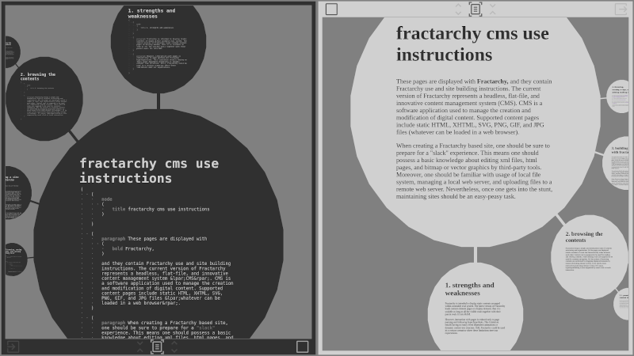

# fractabase

(v 0.1 - alpha)

**tags:** digital-workbook, text-processing, hierarchical-data, fractal-structure-inspired, parent-child-orbiting, zooming-elements-based

- - -

    // under construction //
        

[IDE probe](https://contrast-zone.github.io/fractabase/index.html)

    // under construction //

- - -

# introduction

Let me introduce you to Fractabase, a blend of a database tool and text processor. As one might already guess, Fractabase does things a bit differently. Some users will love it, some users will hate it, while some of us may even form mixed opinions given a plethora of affinity states. Distinctive design choices that were made in creation of Fractabase are supposed to embark users on a brave adventure while discovering its carefully weighed virtues and flaws. Its coding fragment requires an open minded approach to be understood, while its graphical fragment requires a venturesome spirit to have fun with. The combination of these two fragments provides an unique balance between contents creation and contents navigation. Finally, a fair amount of user creativity will be the judge of Fractabase fitness for particular purposes.

## 1. about fractabase

Fractabase is a hierarchical fractal-structure inspired, parent-children orbiting, and zooming-elements based text and graphics organizer. It can be used to manage the creation and modification of digital content. Such purposes include organizing personal or business data and documentation.

### 1.1. use cases

Fractabase **is suited** to be used as:

- static content pages creation platform
- mind map tool
- digital workbook
- hierarchical database
- presentation slide show
- advanced studying organizer
- personal knowledge base keeper
- multi-purpose documentation system
- ...

Fractabase **is not suited** to be used for:

- dynamic content pages creation

## 2. skimming over features

Fractabase user interface and functionality is imbued with symmetry. Contents code pane (left) contrasts contents display pane (right), while integration mode (initial) contrasts derivation mode (alternate). These dualities shaped the direction of Fractabase design features. The dualities operate on top of structured document tree (SDT), thus forming an interface to a kind of hierarchical database of sub-documents.

### 2.1. integration mode

The application starts with integration mode. Integration mode presents SDT fragments in orbitable and zoomable ovals that form a seamless dynamic fractal user interface. We navigate the entire fractal structure using only four kinds of gestures: (1) dragging inside the central oval area to pan its contents, (2) dragging orbiting ovals around the central oval to rotate them, (3) dragging any orbiting oval towards center to zoom it in, or (4) dragging central oval towards orbit to zoom it out.

### 2.2. derivation mode

From integration mode we can enter derivation mode. SDT code can be edited only in derivation mode. Derivation mode detaches and shows the current oval focused from integration mode. Prior to igniting derivation mode, we may fold the tree under the current node. The folding gathers up all the sub-tree children recursively, so we can also alter order and contents of sub-tree children. After modification and exiting derivation mode, we may unfold the current node back to the expanded tree form.

## 3. structured document tree reference

Composing contents in Fractabase is consisted of coding main SDT file and importing graphical or other resources. Simple, yet powerful SDT markup, templating and coding capabilities serve as a Turing complete data definition platform. SDT file format is based on a minimalist s-expr based environment created specifically for purposes of Fractabase, and it should bring an exciting "expert under the hub" atmosphere to the overall Fractabase user experience.

### 3.1. tree structure

STD file format is structured in a following pattern:

    (
        tree
        
        (
            node
            
            ... node contents ...
        )
        
        (
            branches
            
            (
                tree
                
                ... tree contents recursively ...
            )
            
            (
                tree
                
                ... tree contents recursively ...
            )
            
            ... other tree items as branches ...
        )
    )

There is really not much to say about tree structure. The tree structure is a s-expr combined with `tree`, `node`, and `branches` s-exprs. We start with `tree` s-expr, nesting `node` s-expr within. If we want the `node` to branch, we put a `branches` s-expr next to it, to further enumerate branching `tree` s-exprs. We can nest `tree` s-exprs recursively to any depth. When we reach the final nodes that don't branch further, we simply omit the `branches` s-expr.

During visualizetion, each `node` s-expr is then rendered inside its own oval, while orbiting child nodes are extracted from relative `branches` s-expr.

### 3.2. document structure

STD sub-documents are placed inside nodes from the tree structure in a following patern:

    (
        node
        
        ... sub-document contents ...
    )

Sub-documents are a list of words that follow `node` s-expr. Also, instead of words, we can place s-exprs from the following enumeration:

- headings in descending order: `heading1` to `heading6`
- paragraph: `paragraph`
- bold text: `bold`
- italic text: `italic`
- block code: `bcode`
- inline code: `icode`
- block quote: `bquote`
- ordered list: `olist`
    - ordered list item: `litem`
- unordered list: `ulist`
    - unordered list item: `litem`
- hyperlink: `hyperlink`
    - hyperlink address `address`
    - hyperlink target: `target`
- horizontal rule: `hrule`

Restrictions in composing sub-documents are that `icode`, `address`, and `target` accept only quoted strings, while `bcode` accepts a list of quoted strings and interprets them as a range of code lines. `node` head may be replaced in the following way:

    (
        (
            node
            
            (title ... XYZ ...)
        )
        
        ... sub-document contents ...
    )

where `XYZ` is a list of words representing the node title, and `sub-document contents` behaves as described.

### 3.3. templating system

SDT file format is being evaluated as a kind of a term rewriting system. As such, it may be suited even for some advanced tasks naturally involving formula applications, like proof construction for different kinds of logic, truth table calculations, or combinatorial problem solving. Although these kinds of uses may seem intimidating at first, the decision of supporting them doesn't steepen a learning curve needed for basic SDT use. SDT file format may go as deep into content creation as users let it, from simple macro expansions to complex formula calculations. Finally, user range targeted by SDT file format spans anywhere between enthusiastic beginners ready to dive into mysteries of coding, and demanding experts who will know how to reach for advanced SDT capabilities.

    // under construction //
    
## 4. licensing, owning a copy, and joining mailing list

Fractabase is shared to public under [conditional Creative Commons Attribution 4.0 International License](LICENSE) by [Contrast Zone](https://github.com/contrast-zone/) productions. 

A copy of Fractabase software bundle can be downloaded from [dedicated github pages](https://github.com/contrast-zone/fractabase/).

To ask any questions about Fractabase, to report a bug, or to track new releases, please refer to [Contrast Zone mailing list](https://groups.google.com/g/contrast-zone).
