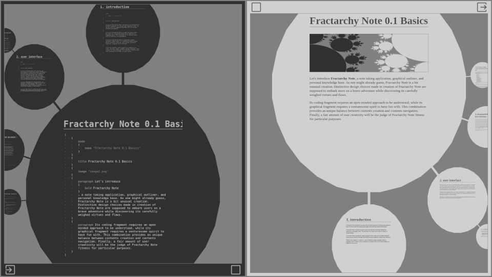
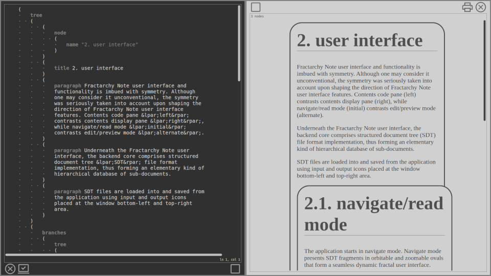

# Fractarchy Note

(v0.1-preview)

**tags:**

structured-document-tree, electronic-workbook, hierarchical-data-organizer, personal-content-management-system, graph-visualization, zooming-elements-based, parent-children-orbiting, fractal-structure-inspired

> ## promotional material
> 
> Fractarchy Note is a (deviant) hierarchical content organizer featuring structured document tree (*.sdt) file format. It is an elementary blend between content management system and hierarchical database. Use it for various purposes as an electronic workbook, hierarchical data organizer, or personal content management system.

## screenshots
        

## use cases

Fractarchy Note **is suited** to be used as:

- static content pages creation platform
- mind map planner
- slide show composer
- text processing toolkit
- hierarchical data organizer
- personal knowledge base keeper
- multi-purpose documentation system
- ...

Fractarchy Note **is not suited** to be used for:

- dynamic content pages creation

## online test

Visit [https://fractarchy.github.io/fractarchy-note/](https://fractarchy.github.io/fractarchy-note/) to try Fractarchy Note online.

## installing and running on local computer

Prerequisites:

* *Node.js* environment

Installing and running the app:

1. Download and unzip this package to an arbitrary local directory
2. Open OS terminal, navigate to the package directory, and run `node index.js 8080`
3. The app is running at port 8080. Visit [http://localhost:8080/](http://localhost:8080/) from the browser.

## use instructions and creating content

Upon running the app, instructions are opened as an initial content in the app visual interface. To create new content, click `input -> new document` menu item. To open existing content, click `input -> open document` menu item.

## licensing

This software is released under [conditional Creative Commons Attribution-NoDerivatives 4.0 International License](LICENSE). It is free for students and for limited personal use, but if you use it a lot, or your plans meet commercial use, please refer to the license file for details about pricing.
